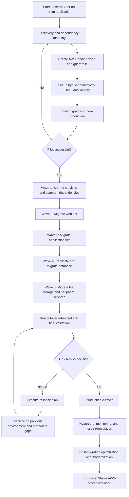

# Cloud Migration Sequencing and Case Study — 3-Tier Application

## Introduction

This document provides a practical migration framework for moving a traditional **3-tier on-premises application** to AWS. It is designed to help answer senior-level interview questions such as:

* How would you migrate a legacy enterprise application to cloud?
* What would you move first?
* How would you reduce risk during migration?
* When would you rehost, replatform, or refactor?
* How would you sequence the migration to avoid business disruption?
* How would you balance speed, reliability, security, and modernization?

The focus here is not just on the **7 Rs**, but on **migration execution**:

* dependency understanding
* migration wave planning
* target-state architecture decisions
* cutover and rollback
* coexistence between on-prem and cloud
* post-migration modernization

---

## 1. Reference Workload: Traditional 3-Tier Application

We will use a realistic enterprise application as the case study.

### Current On-Premises Architecture

The application has three logical tiers.

#### 1. Presentation Tier

* IIS or NGINX based web servers
* serves UI and static assets
* behind an on-prem load balancer
* integrated with enterprise DNS

#### 2. Application Tier

* Java or .NET based application servers
* contains business logic
* communicates with internal enterprise services
* depends on Active Directory / LDAP for authentication
* uses shared configuration files and scheduled jobs

#### 3. Data Tier

* relational database such as SQL Server, Oracle, or PostgreSQL
* hosted on dedicated VMs or physical servers
* uses shared file storage for reports, attachments, or exports
* nightly backups performed on-prem

#### Supporting Dependencies

* Active Directory / LDAP
* SMTP relay
* monitoring tools
* SIEM / centralized logging
* backup tooling
* batch scheduler
* shared file server
* internal APIs hosted in the data center

---

## 2. Migration Goals

Typical business and technical goals for this migration:

* reduce data center dependency
* improve resilience and recoverability
* increase deployment speed
* reduce infrastructure management overhead
* prepare for future modernization
* avoid a high-risk big bang rewrite
* maintain compliance, auditability, and operational visibility

---

## 3. Migration Strategy by Tier

A good migration does **not** force the same strategy on every component.

### Recommended Strategy

#### Web Tier: Rehost or Replatform

* move web servers to EC2 first for speed, or
* replatform to ALB + autoscaled EC2 / containers if operational maturity allows

#### App Tier: Rehost First, Then Modernize Selectively

* initial move to EC2 is often fastest and lowest risk
* later evolve to ECS, EKS, or serverless only if there is clear value

#### Data Tier: Replatform Where Possible

* move from self-managed database to Amazon RDS or Amazon Aurora if supported
* if database engine or application constraints are strong, rehost first and modernize later

#### File Storage: Replatform

* move shared files to Amazon EFS, Amazon FSx, or Amazon S3 depending on access pattern

### Why Mixed Strategy Is Better

A migration should optimize for:

* business continuity
* speed
* risk reduction
* future flexibility

Forcing a full refactor during migration usually increases:

* duration
* uncertainty
* rollback difficulty
* business risk

A practical principle is:

> Migrate for safety first, modernize where it meaningfully reduces operational burden, and refactor only where business value justifies the additional complexity.

---

## 4. Migration Sequencing Framework

A strong migration sequence usually follows these stages.

### Stage 1: Discovery and Assessment

Before moving anything, build a clear picture of the workload.

#### Key Activities

* inventory servers, applications, databases, file shares
* map dependencies between web, app, database, and external systems
* classify applications by criticality
* identify compliance and data residency constraints
* understand current performance baseline
* identify authentication, networking, and DNS dependencies
* document backup and restore procedures
* define acceptable downtime and rollback expectations

#### Key Outputs

* application dependency map
* migration candidate list
* business criticality classification
* current-state architecture diagram
* target-state architecture hypothesis
* risk register

#### AWS Tools Often Used

* AWS Application Discovery Service
* AWS Migration Hub
* interviews with app owners and infra teams
* CMDB and monitoring data
* network flow analysis

### Stage 2: Landing Zone and Foundation Setup

Before migrating workloads, establish the cloud foundation.

#### Core Foundation Components

* AWS Organizations
* multi-account structure
* IAM Identity Center or federated access
* baseline networking design
* VPCs, subnets, route tables
* centralized logging account
* security services and guardrails
* KMS key strategy
* tagging standards
* backup policies
* CI/CD and IaC standards

### Why This Matters

If you migrate workloads before guardrails and foundations exist, you create:

* inconsistent security
* poor visibility
* manual drift
* compliance gaps
* future rework

#### Typical AWS Services

* AWS Organizations
* AWS Control Tower
* AWS IAM Identity Center
* Amazon VPC
* AWS Config
* AWS CloudTrail
* AWS Security Hub
* Amazon GuardDuty
* AWS Backup
* AWS Systems Manager
* Terraform / CloudFormation / CDK

### Stage 3: Non-Production Connectivity and Identity Integration

Before production cutover, prove basic integration.

#### Priorities

* hybrid connectivity between on-prem and AWS
* DNS resolution between environments
* identity federation or AD integration
* outbound access to enterprise dependencies
* private connectivity to required internal services

#### Common Patterns

* Site-to-Site VPN for initial connectivity
* Direct Connect for stable enterprise-grade hybrid traffic
* AWS Managed Microsoft AD or AD Connector if needed
* Route 53 Resolver for hybrid DNS

#### Goal

At this stage, workloads in AWS should be able to:

* authenticate users or service identities
* resolve required hostnames
* reach necessary enterprise systems
* ship logs and metrics centrally

### Stage 4: Pilot Migration

Start with a low-risk slice.

#### What to Choose for Pilot

Pick an application or environment that is:

* non-production
* representative enough to reveal real issues
* not business-critical
* dependent on common platform components

#### Pilot Objectives

* validate landing zone assumptions
* validate network connectivity
* validate IAM and access model
* validate monitoring and backup setup
* validate migration tooling and runbooks
* estimate actual migration duration and issues

#### What Success Looks Like

* app runs in AWS
* dependencies are reachable
* performance is acceptable
* support team can operate it
* rollback path is understood
* lessons are documented for the next wave

### Stage 5: Production Migration in Waves

Do not move everything at once.

A sensible sequencing strategy for a 3-tier app is usually:

#### Wave 1: Shared Dependencies and Foundational Services

Examples:

* logging pipelines
* shared secrets/configuration
* monitoring agents
* backup integration
* file services used by multiple app components

#### Wave 2: Web Tier

The web tier is often the easiest to move first because:

* it is stateless or easier to make stateless
* scaling is simpler
* rollback is easier
* it helps validate external connectivity, DNS, TLS, and load balancing

#### Wave 3: Application Tier

Move business logic after web-tier validation.
This step reveals:

* east-west communication behavior
* dependency on internal services
* session handling assumptions
* config coupling
* scheduler/background job requirements

#### Wave 4: Data Tier

The database is often the highest-risk component and should be migrated only after:

* app behavior is understood
* connectivity is proven
* performance baselines are known
* downtime window is agreed
* replication and cutover plan are tested

### Why Database Later Often Makes Sense

Because the database:

* carries state
* has higher consistency requirements
* has higher rollback complexity
* is often the true critical path during migration

---

## 5. Target AWS Architecture for the 3-Tier Application

### 5.1 Web Tier in AWS

Recommended target:

* Amazon Route 53 for DNS
* AWS WAF in front where internet-facing
* Application Load Balancer
* EC2 Auto Scaling Group or ECS service across multiple AZs
* static assets optionally offloaded to Amazon S3 + CloudFront

#### Good Practice

* make web tier stateless
* externalize session state if needed
* use autoscaling
* terminate TLS at ALB where appropriate
* use health checks and rolling deployment strategy

### 5.2 Application Tier in AWS

Recommended target:

* EC2 Auto Scaling Group for first migration phase, or
* Amazon ECS if container readiness exists
* private subnets only
* IAM roles for workload identity
* Systems Manager for administration instead of direct SSH/RDP where possible
* configuration from Parameter Store or Secrets Manager

#### Good Practice

* decouple config from local files
* isolate background jobs from request-serving nodes
* move scheduled tasks to EventBridge, Systems Manager, or container jobs if possible
* instrument logs, traces, and metrics

### 5.3 Data Tier in AWS

Recommended target:

* Amazon RDS for SQL Server / PostgreSQL / MySQL / Oracle where supported
* Amazon Aurora if fit is strong and modernization is acceptable
* Multi-AZ enabled for high availability
* encrypted storage using KMS
* backups via AWS Backup and native snapshots

#### Data Migration Approaches

* AWS Database Migration Service for minimal downtime migration
* native replication where supported
* backup/restore if downtime window is acceptable
* schema conversion if changing engine

#### Important Design Point

Database migration strategy depends heavily on:

* engine compatibility
* downtime tolerance
* write load
* data size
* rollback constraints

### 5.4 File Storage Strategy

Choose based on access pattern.

#### Amazon EFS

Use when:

* Linux-based shared POSIX file access is needed
* multiple app nodes mount the same file system

#### Amazon FSx

Use when:

* Windows SMB semantics are required
* enterprise file-server behavior is needed

#### Amazon S3

Use when:

* object access is acceptable
* reports, documents, exports, media, archives can be modernized away from shared file semantics

A common migration pattern is:

* keep file semantics initially with EFS/FSx
* later refactor archival and document storage to S3

---

## 6. Example Migration Wave Plan

### Wave 0: Preparation

* application assessment
* dependency mapping
* target architecture defined
* landing zone created
* security and logging baselines in place
* connectivity established
* runbooks written

### Wave 1: Dev/Test Migration

* migrate lower environments first
* validate performance, access, observability
* validate CI/CD to AWS
* document gaps

### Wave 2: Web Tier Migration

* deploy web tier in AWS
* keep app and database on-prem temporarily if latency permits
* validate DNS, TLS, user routing, monitoring
* use a small percentage traffic test if possible

### Wave 3: App Tier Migration

* deploy app tier in AWS private subnets
* validate integration with remaining on-prem dependencies
* externalize config/secrets
* confirm scheduler and background processing behavior

### Wave 4: Database Migration

* establish replication using DMS or native tooling
* run rehearsal cutovers
* validate data integrity and performance
* cut over in planned window
* keep rollback trigger criteria explicit

### Wave 5: File and Peripheral Services Migration

* move shared storage
* move batch jobs
* migrate SMTP/logging/auxiliary integrations if needed
* remove temporary hybrid dependencies where possible

### Wave 6: Optimization and Modernization

* right-size compute
* move static assets to S3/CloudFront
* consider ECS or serverless for suitable components
* reduce hybrid connectivity dependence
* improve autoscaling, resilience, and deployment automation

---

## 7. Cutover Strategy

A migration is won or lost at cutover.

### Cutover Principles

* rehearse before production
* define exact ownership during cutover
* freeze non-essential change
* use a clear go/no-go checklist
* define business validation tests
* define rollback thresholds in advance

### Typical Cutover Activities

* final data sync
* stop writes to old system if needed
* switch DNS / load balancer routing
* validate application functionality
* monitor golden signals
* keep old environment available for rollback window

### Common Cutover Styles

#### Big Bang

All traffic moves at once.
Use only when:

* workload is small
* dependencies are simple
* rollback is fast
* downtime is acceptable

#### Phased Cutover

Move a subset of users, traffic, or functionality first.
Preferred when:

* risk must be controlled
* traffic can be segmented
* blue/green style switching is possible

#### Parallel Run

Both old and new run side by side for a limited time.
Useful when:

* confidence is low
* validation is critical
* data synchronization is manageable

---

## 8. Rollback Strategy

A real migration plan always includes rollback.

### Rollback Questions to Answer in Advance

* what exact condition triggers rollback?
* who decides rollback?
* how long is the rollback window?
* what data divergence can be tolerated?
* what communication plan exists?

### Rollback Examples

* switch DNS back to on-prem endpoint
* restore database from pre-cutover snapshot
* re-enable old load balancer
* revert application config to old endpoints

### Important Caution

Rollback becomes harder once:

* writes occur only in the new environment
* schemas change incompatibly
* external integrations have switched permanently

That is why schema compatibility and controlled cutover design matter so much.

---

## 9. Risk Register for 3-Tier Migration

Typical migration risks include:

### 1. Hidden Dependencies

A web/app server may call:

* hardcoded IPs
* legacy shared services
* internal APIs
* mounted drives
* AD-integrated services

Mitigation:

* dependency discovery
* packet/log analysis
* pilot migration
* runbooks for fallback

### 2. Latency Increase During Hybrid Phase

If web/app are in AWS but DB remains on-prem, latency may hurt performance.

Mitigation:

* keep chatty tiers together where possible
* measure before production
* shorten hybrid coexistence
* optimize connection reuse

### 3. Authentication Failure

AD or LDAP assumptions may break in cloud.

Mitigation:

* test identity integration early
* validate service account behavior
* avoid leaving identity validation to final cutover

### 4. Data Sync Issues

Replication lag, schema mismatch, or missed CDC events can break cutover.

Mitigation:

* rehearsal cutovers
* checksums / validation queries
* clear write-freeze process
* fallback snapshots

### 5. Operational Unpreparedness

The application may technically run, but support teams may not know how to operate it in AWS.

Mitigation:

* runbooks
* dashboards
* alarms
* ownership definitions
* game day or simulation

---

## 10. Security Considerations During Migration

Migration should not create a temporary security downgrade.

### Key Controls

* least-privilege IAM roles
* security groups and subnet segmentation
* encryption at rest and in transit
* secrets moved out of local config files
* CloudTrail, Config, and GuardDuty enabled
* centralized log retention
* backup and recovery tested
* restricted admin access using Systems Manager / federation

### Migration-Specific Security Risks

* temporary open firewall rules
* over-privileged migration tooling
* exposed replication endpoints
* secrets copied manually into scripts
* unencrypted backup transfers

A senior answer should explicitly mention that migration often creates temporary exceptions, and these must be tracked and removed.

---

## 11. Observability and Operational Readiness

Before production cutover, the AWS-hosted version must be operable.

### Minimum Operational Readiness

* infrastructure metrics visible
* application logs centralized
* health checks working
* alerts routed correctly
* dashboards for latency, traffic, errors, saturation
* backup success monitored
* runbooks for known failure modes
* deployment process documented

### Typical AWS Services

* Amazon CloudWatch
* AWS X-Ray or OpenTelemetry tooling
* AWS Systems Manager
* Amazon EventBridge
* SNS for alert delivery

---

## 12. When to Modernize During Migration vs After

This is a classic interview discussion.

### Modernize During Migration When

* it significantly reduces operational burden
* the change is low-risk and high-value
* it removes major blockers
* the team has enough maturity and testing confidence

Examples:

* self-managed DB to RDS
* local secrets to Secrets Manager
* shared static assets to S3
* admin access via Session Manager instead of SSH bastions

### Modernize After Migration When

* refactor scope is large
* rollback would become too hard
* business timelines are tight
* architecture is poorly understood
* change blast radius is too large

Examples:

* monolith to microservices
* VM to container platform redesign
* database engine redesign
* deep event-driven re-architecture

A good principle is:
**separate migration risk from transformation risk unless there is a strong reason to combine them.**

---

## 13. Post-Migration Optimization Roadmap

Cloud migration is not the finish line.

After stabilization, optimization usually includes:

### Reliability

* Multi-AZ hardening
* autoscaling improvements
* backup restore drills
* DR design refinement

### Security

* tighter IAM policies
* better guardrails
* security automation
* secret rotation

### Performance

* right-sizing
* caching
* database tuning
* CDN adoption

### Cost

* Savings Plans / Reserved capacity where appropriate
* storage lifecycle policies
* shutdown schedules for non-prod
* idle resource cleanup

### Modernization

* containerization
* decomposition of tightly coupled services
* event-driven workflows
* database redesign if justified

---

## 14. End-to-End Example Answer for Interviews

If asked:

**How would you migrate a legacy 3-tier on-prem application to AWS?**

A strong answer could sound like this:

> I would start by assessing the current web, application, and database tiers, including dependency mapping to identity systems, file shares, internal APIs, and batch jobs. I would avoid choosing one migration strategy for the whole stack. For a typical 3-tier enterprise app, I would usually rehost or lightly replatform the web and app tiers first, and replatform the database to RDS where feasible, because that reduces operational burden without forcing a risky full refactor.
>
> I would establish the AWS foundation first: accounts, networking, logging, IAM federation, guardrails, backup, and observability. Then I would validate hybrid connectivity, DNS, and identity integration before moving any production traffic.
>
> For sequencing, I would migrate lower environments first, then move the web tier, then the application tier, and leave the database for a carefully rehearsed cutover once behavior and performance are understood. During the hybrid phase, I would watch for latency issues between app and DB tiers and keep that coexistence window as short as possible.
>
> For cutover, I would prefer a phased or rehearsed approach rather than a big bang. I would define data sync, validation, go/no-go criteria, and rollback triggers in advance. After stabilization, I would optimize the platform further with autoscaling, storage modernization, stronger IAM, cost optimization, and selective modernization such as moving suitable components to containers or serverless.

That answer shows:

* sequencing
* judgment
* risk management
* platform thinking
* modernization awareness
* operational maturity

---

## 15. Key Interview Takeaways

For a 3-tier migration, the most important points to remember are:

* do not treat all components the same
* build cloud foundations before migrating workloads
* validate connectivity and identity early
* migrate in waves, not in a single leap
* keep the database cutover deliberate and rehearsed
* always define rollback before cutover
* minimize time spent in awkward hybrid states
* modernize where it clearly reduces risk or operational burden
* postpone deep refactoring unless business value justifies it
* treat migration as both a technical and operating model change

---

## 16. Quick Summary Table

| Area           | Recommended Approach                                         |
| -------------- | ------------------------------------------------------------ |
| Web tier       | Rehost or light replatform behind ALB                        |
| App tier       | Rehost first, modernize selectively later                    |
| Database tier  | Prefer RDS/Aurora where feasible; otherwise staged migration |
| File storage   | EFS/FSx initially, S3 where object model works               |
| Connectivity   | VPN first, Direct Connect for long-term hybrid               |
| Identity       | Federated IAM + AD integration where needed                  |
| Sequencing     | Dev/Test → Web → App → DB → peripheral services              |
| Cutover        | Rehearsed, phased where possible                             |
| Rollback       | Explicit triggers, ownership, and time window                |
| Post-migration | Stabilize, optimize, then modernize                          |

---

## 17. Migration Workflow Diagram

### How to Read the Workflow

* Start with discovery, not technology choices.
* Build the landing zone and controls before moving workloads.
* Validate connectivity and identity before pilot.
* Use the pilot to uncover hidden risks early.
* Migrate production in waves: shared dependencies, web, app, database, then remaining services.
* Rehearse cutover and keep rollback criteria explicit.
* Only after stabilization should you focus on deeper modernization.
